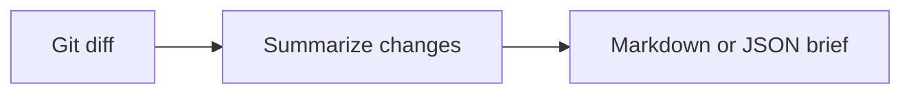

<!-- readme-refresh:start -->
<p align="center">
  <picture>
    <source media="(prefers-color-scheme: dark)" srcset="assets/readme-banner.png">
    <source media="(prefers-color-scheme: light)" srcset="assets/readme-banner.png">
    
  </picture>
</p>

<h1 align="center">📝 GitBrief</h1>

<p align="center"><strong>Turn any Git diff into a deterministic review brief and risk hints.</strong></p>

<p align="center">
  <a href="https://github.com/al1re3a/gitbrief/actions/workflows/ci.yml"></a>
  <a href="https://go.dev/"></a>
  <a href="LICENSE"></a>
  <a href="https://github.com/al1re3a/gitbrief/stargazers"></a>
  <a href="https://github.com/al1re3a/gitbrief/issues"></a>
</p>

<p align="center">
  <a href="https://github.com/al1re3a/gitbrief"></a>
  <a href="#usage"></a>
  <a href="CONTRIBUTING.md"></a>
  <a href="SECURITY.md"></a>
</p>

<p align="center">
  
</p>

> [!NOTE]
> Risk hints help focus review attention and do not replace a security review or project-specific test plan.

## 📑 Contents

- [At a glance](#-at-a-glance)
- [Why](#why)
- [Usage](#usage)
- [Output includes](#output-includes)
- [Development](#development)

---

## 🔎 At a glance

| | |
|---|---|
| **Purpose** | Deterministic pull-request summaries and review-risk hints from any Git diff. Zero-dependency Go CLI. |
| **Input** | Git diff |
| **Output** | Markdown or JSON brief |
| **Runtime** | Go 1.23+ |
| **CI** | ✅ Linux · Windows |
| **Status** | ✅ Maintained |

<details>
<summary><strong>🧭 How it works</strong></summary>



</details>

<details>
<summary><strong>📁 Repository layout</strong></summary>

```text
gitbrief/
├── .github/
├── examples/
├── go.mod
├── main.go
└── README.md
```

</details>

<details>
<summary><strong>🤝 Contributors</strong></summary>

<br>
<a href="https://github.com/al1re3a/gitbrief/graphs/contributors">
  
</a>

</details>
<!-- readme-refresh:end -->

**A useful PR description before the model call.**

GitBrief turns a unified Git diff into a deterministic Markdown change map: files, categories, line counts, stable fingerprint, and review notes for large, untested, dependency, auth, or workflow changes.

```bash
go install github.com/al1re3a/gitbrief@latest
gitbrief -base main > PR_BODY.md
```

## Why

AI-written PR summaries can be helpful, but the factual layer should not depend on a model. GitBrief produces an instant local baseline that a human or agent can extend without losing the actual change shape.

## Usage

```bash
# Current branch versus main
gitbrief -base main

# Saved or piped diff
gitbrief -file change.diff
git diff --staged | gitbrief

# Automation
gitbrief -base origin/main -format json
```

## Output includes

- Per-file additions and deletions
- Source, tests, docs, config, dependency, and asset categories
- Missing-test and large-change notes
- Auth, permission, workflow, and dependency review flags
- Stable diff fingerprint for reruns

GitBrief never claims to understand behavior; it makes review scope visible.

## Development

```bash
go test ./...
go run . -file examples/change.diff
```

## License

MIT
